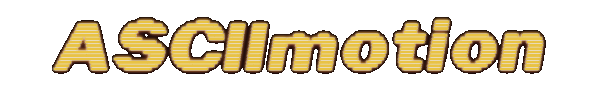

<div align="center">
  
</div>

# ASCIImotion

A browser-based tool for converting images and videos into ASCII art animations.

## Overview

ASCIImotion is a client-side web application that transforms raster images and video content into ASCII character representations. All processing occurs in your browser with no data transmitted to remote servers.

## Features

- **Media Support**: Process images (JPG, PNG, GIF) and videos (MP4)
- **Image Controls**: Adjust width, brightness, contrast, and blur
- **Effects**: Invert colors, skip colors, and various dithering algorithms
- **Character Sets**: Multiple predefined sets or custom character mapping
- **Edge Detection**: Sobel, DoG (Contour), Canny, CLAHE, and LBP algorithms
- **Animation**: Generate and play ASCII animations from video files
- **Export Options**: Copy text, download high-resolution PNG, export animations as HTML/JS package, or generate 4K MP4 video

## Usage

1. Open `index.html` in a modern web browser
2. Upload an image or video file
3. For videos, select frame count and process the file
4. Adjust parameters to customize your ASCII art
5. Use export options to save or share your creation

## Development

```
# Install dependencies
npm install

# Format code
npm run format-all
```

## License

Released under MIT License.

## Credits

- Initially developed for creating ASCII animation art for Gx2 Studio
- Based on Monospace by [Mike Bespalov](https://mishkadoing.com)
